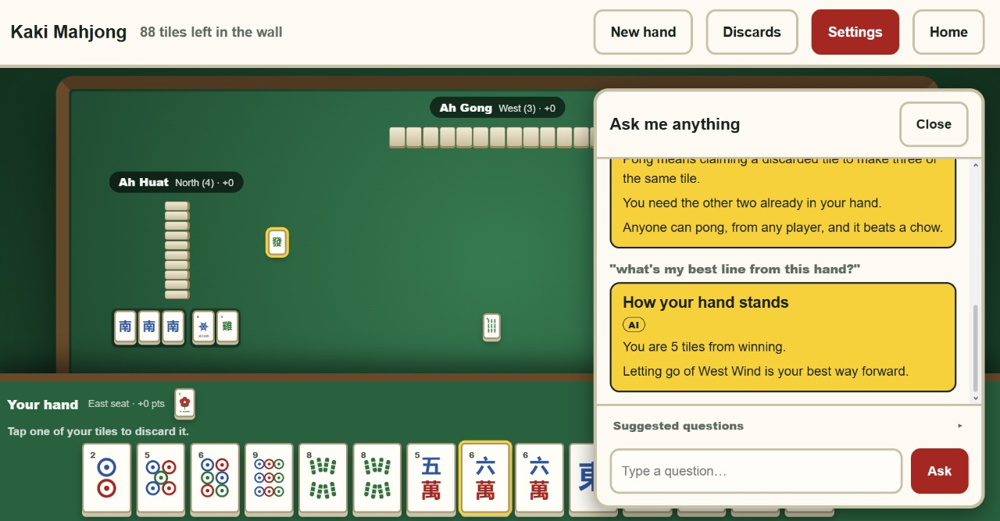

# the_c_team — Kaki Mahjong

_simplynext 2026 hackathon_

## Setup & installation

### Prerequisites

- **Node.js 18+** and **npm** (that is all you need to run the game)
- Only if you plan to deploy the AWS backend: an AWS account with the AWS CLI
  configured (`aws configure`) and the AWS CDK CLI (`npm install -g aws-cdk`, or
  use `npx cdk …`)

### Install

This is a monorepo of three independent npm workspaces. Each has its own
dependencies, so install per workspace — there is no root `npm install`.

```bash
# 1. The game (React + Vite) — this is all you need for the playable app
cd frontend
npm install

# 2. The AI agent framework (only if working on the coach / review agents)
cd ../agents
npm install

# 3. The AWS backend (only if working on or deploying the cloud pieces)
cd ../backend
npm install
```

`agents` and `backend` depend on the frontend's game engine and on each other
through local `file:` paths, so install `frontend` first if you install all three.

### Run the game

```bash
cd frontend
npm run dev        # http://localhost:5173
```

You are seat 0 (bottom of the screen). The other three seats are AI bots. The
game is fully playable offline — no backend, no API key, no network calls.

### Run the tests

```bash
cd frontend && npm test          # rules engine, tile art, help coach, table layout
cd agents   && npm test          # agent pipeline (Bedrock mocked — no AWS calls)
cd backend  && npm test          # classify-intent Lambda (Bedrock mocked)
```

### Configuration (optional)

Every `.env` file is optional; the game runs with none of them.

| File | Purpose |
|---|---|
| `.env.template` (root) | Names the AWS credential variables used when deploying the backend. Copy to `.env` and fill in — never commit real keys. |
| `frontend/.env.template` | Copy to `frontend/.env.local`. Three optional `VITE_*` URLs that switch on the model-assisted coach / review tiers. Left blank, the coach is 100% local. |

See `backend/README.md` for the full deploy walkthrough (`npx cdk bootstrap` /
`synth` / `deploy`).

## What this is

**Kaki Mahjong** is a single-player, rules-accurate **Singapore Mahjong** game
built for beginners. You play one hand against three heuristic AI bots (Ah
Ma, Ah Gong, Ah Huat) on a real tile-legality, claim-priority and _tai_-scoring
engine.

The interface is accessibility-first: one size slider that scales tiles, text and
tap targets together; a high-contrast theme where colour is never the only cue;
"are you sure?" confirmation before every discard and call; every legal
Chow/Pong/Kong/Win shown as its own large button; optional voice narration; and
no timers anywhere.



A built-in **help coach** answers questions about the rules and the hand in front
of you ("what does pong do?", "what should I discard?"). It runs entirely locally
by default. An optional AWS backend adds two model-assisted tiers that degrade
safely back to the local coach on any failure. A **post-hand review** summarises
what you played well and what to try next time, also offline-first.

`docs/mvp-notes.md` is the detailed status: what is built, what is deferred, and
the deliberate MVP simplifications.

## Repository layout

| Folder | What it is | Stack |
|---|---|---|
| `frontend/` | The game — engine, accessible UI, local help coach. Runs standalone. | React 19, Vite |
| `agents/` | AI agent framework: post-hand review + last-resort coach answer. Deterministic context → one Bedrock call → strict validation → deterministic fallback. | Node, AWS SDK (Bedrock) |
| `backend/` | AWS infrastructure as code: WebSocket + HTTP APIs, Lambda, DynamoDB, S3/CloudFront, Polly, Cognito. | AWS CDK (TypeScript) |
| `docs/` | `mvp-notes.md` — build status and design notes | — |
| `tasks/` | `todo.md` — running plan / review log | — |

The game engine in `frontend/src/game/` has no React imports, so `agents/` and
`backend/` re-import it directly as `@kaki/game`.

## Where dependencies are declared

Each workspace declares its dependencies in a **`package.json`** (dependency
names and their version ranges), with a committed **`package-lock.json`** pinning
the exact resolved versions for reproducible installs. Read or edit these to see
what a workspace pulls in:

| Manifest | Lockfile | Key dependencies |
|---|---|---|
| `frontend/package.json` | `frontend/package-lock.json` | `react`, `react-dom`; dev: `vite`, `vitest`, `@testing-library/*` |
| `agents/package.json` | `agents/package-lock.json` | `@aws-sdk/client-bedrock-runtime`, `@kaki/game` (local) |
| `backend/package.json` | `backend/package-lock.json` | `aws-cdk-lib`, `constructs`, `@aws-sdk/client-*`, `@kaki/agents` + `@kaki/game` (local); dev: `aws-cdk`, `typescript`, `ts-node`, `esbuild` |

Run `npm install` inside a workspace to install that workspace's manifest.
